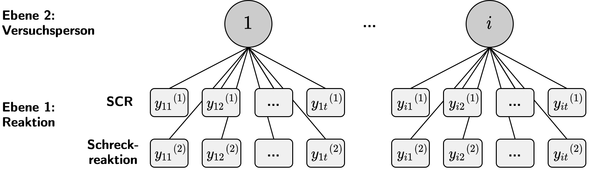

# Bachelorarbeit

A repo for preprocessing and analyzing experimental EMG and EDA Biopac Data in R used for my bachelor thesis in biological psychology. 

## Repo Content
The repo contains R files for 
- (0) importing the data, 
- (1) exploratory data analysis, 
- (2) plots for EDA, 
- (3) Analysis using Multivariate Multilevel Regression Model, and 
- (4) plots of the results
as well as tex files for creating the Bachelor Thesis manuscript

## Data
The data was acquired within a fear conditioning experiment conducted at the University of Potsdam. Participants were presented with geometrical stimuli on a computer screen. One of the geometrical stimuli was paired with an electrical stimulus on 50% of the trials (CS+), while the other one was never paired with such a stimulus (CS-). Startle-Eye-Blink responses (STR; measures muscle activity of orbicularis oculi) to the geometrical stimuli as well as skin conductance responses (SCR; indicator for electrodermal responses) were acquired for each participant. After half of the trials, the participants were instructed via the computer screen about the 50% contingency between CS+ and electric stimulation. 

## Question & Theoretical Background
STR and SCR are two of the most commonly used indicators of fear acquiring processes in human fear conditioning research. However, it is still debated in how far these two can be associated with distinct learning mechanisms. It has been suggested, that the SCR reflects the acquistion of contingency knowledge on a rather cognitive level, while the STR is indicative of a rather automatic (unconscious) level. In this bachelor thesis I analysed STR- and SCR data from a fear conditioning study to exploratorily look at the differences between the two measures over time. Specifically, I was interested in the trajectories of STR and SCR during the fear acquisition trials where people potentially learn to discriminate between a stimuli followed by a fear stimulus (CS+) and a stimuli that suggests safety (CS-). 

## Analysis
The data was analysed using a multivariate multilevel regression model coded in nlme package in R. This modelling approach was used to look at the growth curves of the two variables over time in the same model while accounting for the broad variability between participants' data which is commonly observed in peripheral psychological measurements.
The figure depicts the hierarchical structure that was employed:

## Results
The results showed a significant interaction effect for CS type (+ or -) and SCR, but not so for the STR. Looking at the time course it became apparent that a differential effect between CS+ and CS- only occured after instruction of participants. This suggests, that the observed stem from a instructional effect rather than the uninstructed learning process in the first half of the trials.

